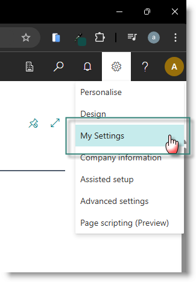
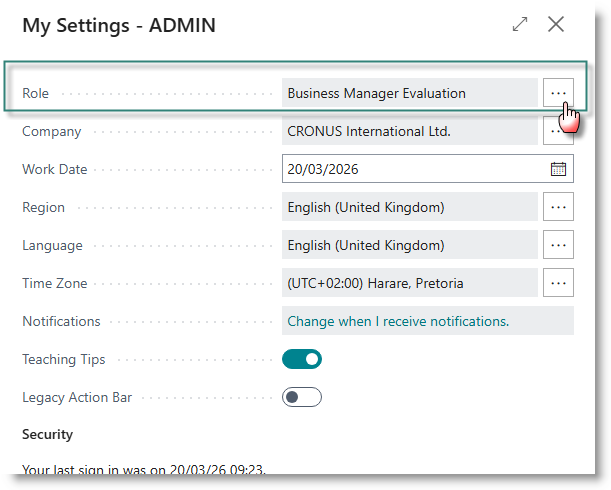
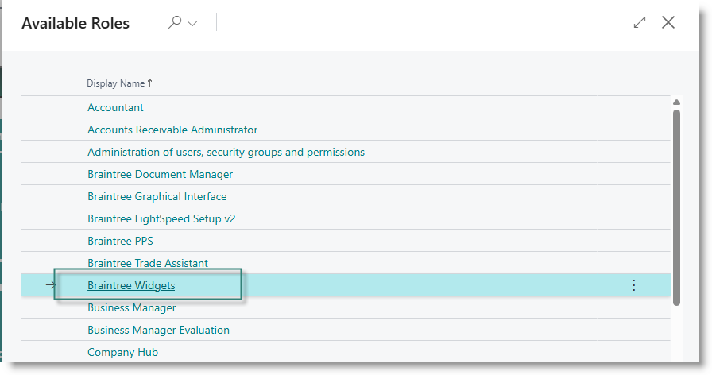
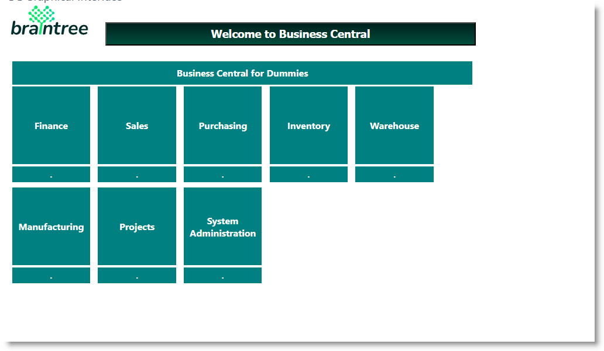

# Braintree Widgets Configuration
Braintree Widgets come pre-installed colour definitions, templates and page configurations, so you can get going as fast as possible. You have the option to modify any of these to suit your own tastes and requirements.

## Widgets Setup
Search for 'Widgets Setup', and open the page:

## Colour List
The Colour List is used to review and configure colours which can be applied to templates and page setups.

From the Widget Setups page, click on 'Colour List':

The list of predefined standard colours will be presented. As you click on each record, a sample swatch of the colour will appear in the page header:

### Adding a custom colour
Click on New.
In the blank record, capture as follows:

| **Column** |**Value** | 
|---|---|
|Code|Provide a unique code of up to 20 characters|
|Colour Enum | Select 'Custom' |
|Description | Enter a user-friendly description |
|Colour Code | Enter the Hex code, or click on the (...) to pick a colour|

**Picking a colour**

The colour picker appears:

Click on one of the standard swatches to select the colour

If you have the hex code, enter it in the input box

Click on Detail to select from the palette. 

The related hex code will be returned to the Colour Picker. 
Click OK to return to the colour setup list.

## Layout Templates
Braintree Widgets comes with a number of pre-installed templates, which can be used to configure layouts for different Widgets. They provide a range of options for colour schemes and sizing.

From the Widget Setup page, select 'Layout templates':

The list of available templates will open.

Click on the Template Code to open the template card:

Each tab on the page represents a different part of the widget page 

|Tab |Content |
|---|---|
|General |General identification and default colours |
|Application Banner|Settings for the page banner|
|Main Control |Settings for the page content |

**Template Fields**
The template fields define default formatting for pages based on the template. When the page is configured, the template values are copied to the page. Thereafter, they can be modified for the specific page.

Below is an example of a page defined on the GREEN template

|Field|Content|
|---|---|
|Template code |Unique Identifier for the template |
|Template Name|Template description|
|Banner Background Style|HTML string to set the background style of the page banner. |
|Banner Height |The height in pixels of the page banner |
|Banner Width |The width in pixels of the page banner |
|Application Title |The title to display on the page|
|Main Control Background Style|HTML string defining the style of the page background|
|Main Control Height|Height in pixels of the main page background |
|Button Height|Height in pixels of the buttons on the page|
|Button Width|Height in pixels of the buttons on the page|
|Button Background Style|HTML string defining the background style of the buttons|
|Button Foreground Style|HTML string defining the foreground style of the buttons|
|Mouse Colour|HTML string defining the style of a button when a mouse passes over it|
|InfoArea Background Style|HTML string defining the background style of the InfoArea buttons |
|InfoArea Foreground Style|HTML string defining the foreground style of the InfoArea buttons|

**Using the Style Helper**
Not everyone is an expert in HTML formatting strings. Fortunately, you don't need to be.
The style strings can be generated using the formatting helper. Click on the (...) next to any format control to open it. 

The Style Helper page will open.

Capture as follows:

| **Field name** | **Content** |
|---|---|
|Select background colour|Select a colour from the drop down | 
|Select background blend colour|For a background made up of two blended colours, select a colour from the dropdown. If you want to use a solid colour, leave blank|
|Gradient Type |If you are use a blended background, choose from Linear or Radial|
|Select Border colour| Select a colour from the dropdown|
|Border thickness |Enter number of points for the border|
|Border Radius|For rounded corners, enter number of points to round|
|Select text colour|Select the colour for the text displayed in a button|
|Text Font|Type the name of the text font. (Make sure the font you choose is installed on your computer)|
|Text Size|Enter the font size|
|Text Bold|Turn on if you want text to display as **bold**|
|Text Italic |Turn on if you want text to display as *italic*|

As you make changes to the formatting strings, a sample will be displayed at the bottom of the screen. Below are some examples:

**White on plain teal, no border**

**Burlywood on blended darkgreen and blanched almond**

**Blanchedalmond on DarkGreen with 5pt Goldenrod border, rounded corners**

## The Widgets Role Centre
Go to Settings -> My Settings:

Click on the (...) next to Role:

Select 'Braintree Widgets' and click on OK:

The Widgets Role Centre will appear:

